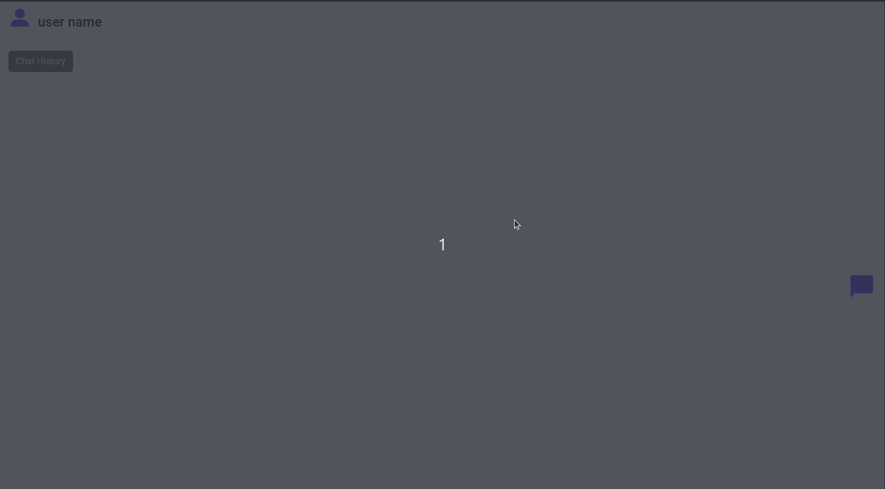

# Chat Bot



## Descripcion

Se trata de un chatbot que tiene como funcionalidad reconcer palabras como "Hello", "i want", "good", "goodbye" y dar alguna respuesta a cambio.

Si el usuario digita la palabra "loan", el chat bot muestra 3 links con contenido específico.

Otra funcionalidad es poder lguearse(ficticio-guarda usuario y contraseña junto con los chats)para iniciar el chat, mostrar un listado de usuarios con  chats ordenados por fecha y poder exportarlo a CSV.

Se utiliza Firestore para la base de datos, que guarda la información de los usuarios, fecha  de la finalización del chat  al digitar "goodbye".

## Clonar proyecto

Elije una carpeta de preferencia, abre la terminal  ejecuta el siguiente comando.

```
git clone https://github.com/mattyys/firstChatbot.git
```

Accede a la carpeta descargada, instala dependencias y corre el proyecto.

```
cd firstchatbot
npm install
npm run dev
```

## Tecnologias utilizadas:

* React.
* Html / CSS.
* Javascript
* BootStrap
* Firestore
* React-chatbot-kit
* React-hook-form
* React-router-dom
* React-icons
* React-spinners

## Observaciones:

Este proyecto es una consigna para aplicar a una empresa, no había tenido la oportunidad de trabajar con la lógica de un chatbot, es un desafío bastante importante para mi, el cual todavía no lo termine pero voy a estar trabajando en ello.

Agradezco feedbacks.
